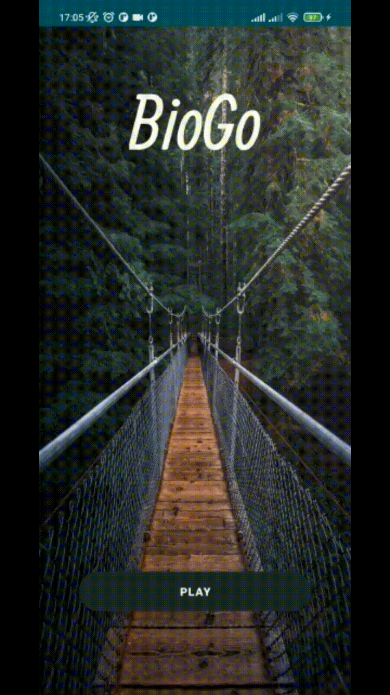
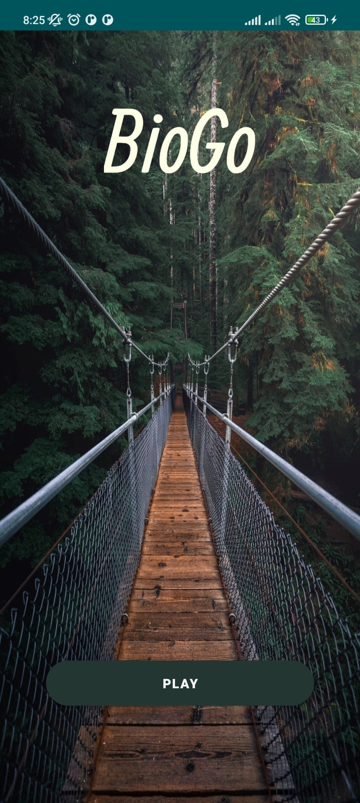
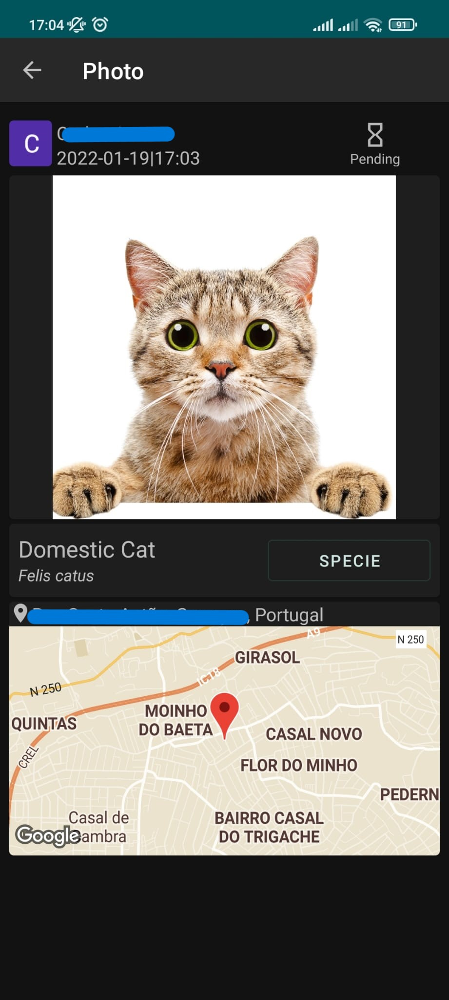

# BioGo

This project aimed to collect data about available species in regions through a mobile game similar to Pokemon. The game consists of the players taking pictures of animals and plants at a given location and uploading them to be validated by expert users within the game. After the validation, the user receives points based on the species' rarity, increasing their rank position. 

## Technologies
- [INaturalist](https://www.inaturalist.org/) API: Integrated to fetch information about the species captured in the game, providing users with additional details
- Firebase: User for authentication, Cloud Storage (for user-uploaded pictures), and Cloud Firestore (for data storage).
- Android SDK, Java and Material UI: Used to develop the mobile game interface and functionality.

## Demo

  
  

